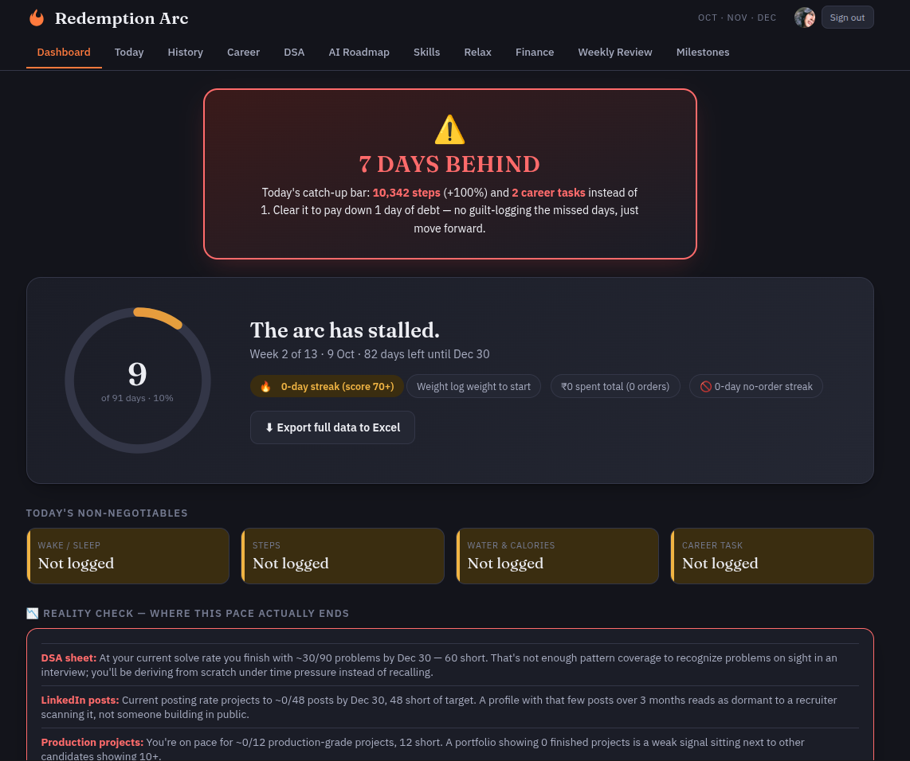
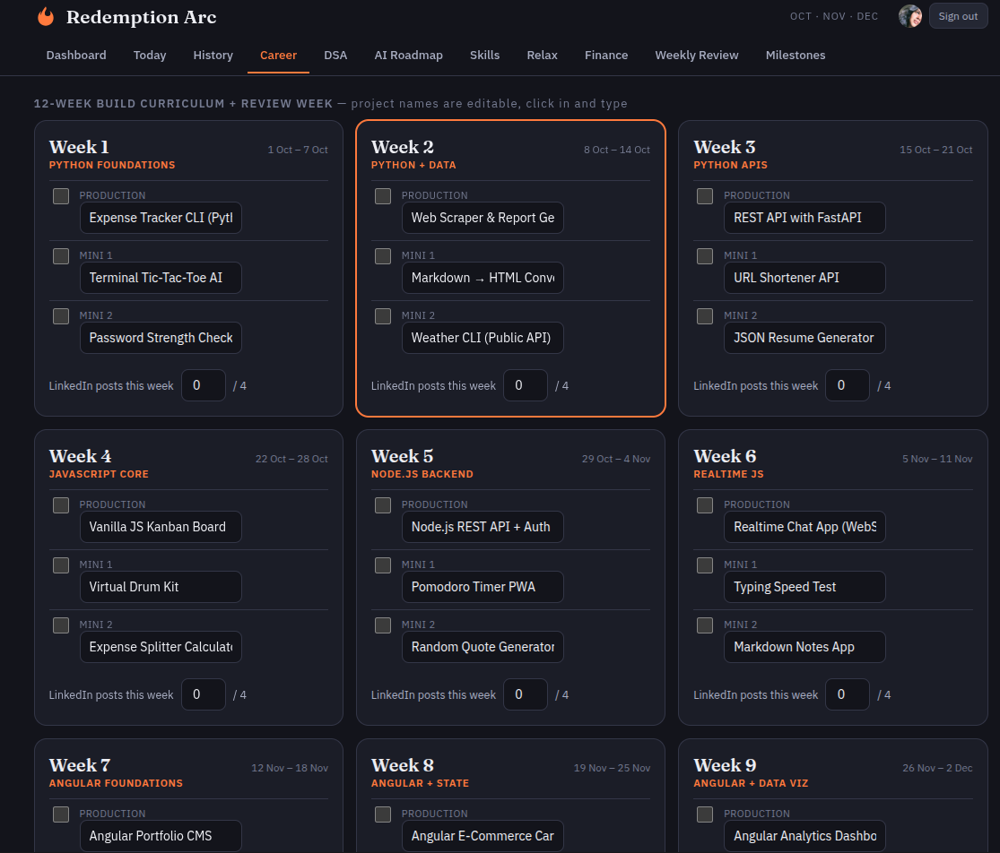

# Redemption Arc

**Your 91-day comeback, tracked in one place.**



**[Live demo](https://nisha-karithikeyan.github.io/redemption-arc/)**

Redemption Arc is a personal life tracker for rebuilding your habits across body, career, money and mind, all at once. Set your non-negotiables, log each day in under a minute, and watch your progress build over 13 weeks.

It's free, private and works on any device. You host your own copy, and your data lives in your own Firebase project, where only you can read it.

---

## Why Redemption Arc?

Most habit apps track one thing, but real change rarely happens in one area. Sleep affects focus, focus affects career, and stress affects spending. Redemption Arc puts it all on one dashboard so you can see the whole picture and keep going on the days you'd rather not.

- **One daily score.** Every day gets a live 0–100 score based on the habits you've committed to.
- **Streaks that mean something.** Hit your core rules and the streak grows. Miss a day and the app gives you a recovery plan instead of shame.
- **Catch-up, not give-up.** Each day you skip logging adds one day of "catch-up debt". Today's step goal goes up 20% per day owed (up to double), and you need 2 career tasks instead of 1. Hit that and one day of debt is paid off, so one bad day doesn't end the run.
- **Gradual ramps.** Goals like daily steps start where you are (4k) and climb steadily (to 10k) over six weeks.
- **Synced everywhere.** Sign in with Google on your phone, laptop or tablet and see the same data on each.
- **Own your records.** Export everything to Excel any time with one click.

## What's inside



| Tab | What it does |
|---|---|
| **Dashboard** | Day-X-of-91 progress arc, today's non-negotiables, streak, weight trend, career output, money saved, catch-up alerts, Excel export |
| **Today** | Quick daily log (wake, sleep, steps, water, calories, career task, mood, cravings) with a live score |
| **History** | Look back at any past day and see what went right or wrong |
| **Career** | A 13-week learning plan with weekly projects and a content/posting tracker |
| **DSA** | A curated 90-problem interview prep sheet, organized by pattern |
| **AI Roadmap** | A gamified AI Engineering path with XP, levels and ranks, plus concepts, build tasks and resources for each step |
| **Skills** | Mastery checklists for the skills you're building |
| **Relax** | A daily rotating "do something good for yourself" activity |
| **Finance** | Money saved vs. your goal, with a weekly chart |
| **Weekly Review** | A 4-question Sunday check-in: body, career, money, mind |
| **Milestones** | Day 30 / 60 / 90 checkpoints to capture how far you've come |

## Make it yours

Out of the box, Redemption Arc ships with a **software engineer's plan**: the Career, DSA and AI Roadmap tabs are built for someone preparing for tech interviews. Every part of it can be swapped out.

All goals, rules and content are plain JavaScript near the top of [`app.js`](./app.js). No build step or framework knowledge needed.

| Want to change… | Edit this in `app.js` |
|---|---|
| Start date and length of your arc | `START`, `TOTAL_DAYS` |
| Your daily non-negotiables (labels) | `CORE_RULES` |
| How each rule is checked, plus water and calorie targets and bonus points | `scoreForDay()` |
| Sleep and wake targets | `SLEEP_TARGET`, `WAKE_TARGET` |
| Step goal ramp | `STEP_RAMP_START`, `STEP_RAMP_END`, `STEP_RAMP_DAYS` |
| Career plan and weekly projects | `WEEKS`, `CAREER_TASKS` |
| Skill checklists | `SKILLS` |
| Learning roadmap | `AIE_NODES`, `AIE_LEVELS`, `AIE_RANKS` |
| Self-care activities | `RELAX` |
| Milestone days | `MILESTONES` |

Training for a marathon, studying for an exam, paying off debt, recovering from burnout? Replace the rules and content with your own and it becomes your tracker.

---

## Get started (about 10 minutes, free)

Each person runs their own copy, so your data never mixes with anyone else's. You need a GitHub account and a Google account.

### 1. Get your own copy

Click **Use this template** (or **Fork**) at the top of this page.

### 2. Create your Firebase project

1. Go to the [Firebase console](https://console.firebase.google.com/) and click **Add project**. Name it anything. Google Analytics is optional.
2. **Build → Authentication → Get started → Sign-in method** → enable **Google** → save.
3. **Build → Firestore Database → Create database** → **production mode** → pick a region near you.
4. In Firestore's **Rules** tab, paste the contents of [`firestore.rules`](./firestore.rules) and click **Publish**. These rules make sure only you can read or write your data.
5. **Project settings** (gear icon) → **Your apps** → **</>** (web) → register an app → copy the `firebaseConfig` values.
6. Paste those values into [`firebase-config.js`](./firebase-config.js).

Personal use fits comfortably within Firebase's free **Spark plan**. No credit card needed.

### 3. Put it online with GitHub Pages

In your repo: **Settings → Pages → Source: Deploy from branch → `main` / (root)**.

Your tracker will be live at `https://<your-username>.github.io/<repo-name>/`.

Then in Firebase → **Authentication → Settings → Authorized domains**, add `<your-username>.github.io`. Without this, Google sign-in won't work.

### 4. Set your start date and begin

1. In `app.js`, set `START` to the day you want your arc to begin, and adjust `CORE_RULES` and any targets you want to change. Commit the change.
2. Open your URL on any device, sign in with Google, and log Day 1.

### Running locally (optional)

Google sign-in doesn't work when you open `index.html` directly from your files. Serve it instead:

```bash
npx serve .
```

Then open `http://localhost:3000`. (`localhost` is authorized in Firebase by default.)

---

## How it works

- **Architecture:** a static site with no backend. The browser talks directly to Firebase Auth and Firestore. Firebase and the Excel export library are loaded from a CDN, so there's nothing to install.
- **Data model:** everything lives under `users/{uid}/` in Firestore. There's one document per logged day at `users/{uid}/days/{YYYY-MM-DD}`, plus documents for your profile, skills, DSA and AI Roadmap progress.
- **Daily score:** each of the 6 core rules is worth 10 points (60 total). Four bonus habits are worth 10 each (40 total): screen time of 3 hours or less, doing the day's relax activity, logging your mood, and resisting every craving. The score updates live as you log.
- **Streaks and catch-up:** a day counts toward the streak when it scores 70 or more. A day with no entry counts as missed and adds catch-up debt, which you pay off one day at a time by hitting the boosted targets.
- **Why no build tools:** anyone can fork it, edit one file and deploy, with no Node setup, bundler or framework version to keep up with.

## Privacy and security

- **No servers and no third parties.** Your browser talks directly to your own Firebase project.
- **Only you can access your data.** [`firestore.rules`](./firestore.rules) locks every record to the signed-in owner.
- **The config isn't a secret.** The values in `firebase-config.js` identify your project but don't grant access to it, so they're safe in a public repo.
- **You can leave any time.** Export to Excel, or delete your Firebase project to remove everything.

## Tech

HTML, CSS and vanilla JavaScript · Firebase Authentication (Google) · Cloud Firestore · GitHub Pages

## License

[MIT](./LICENSE). Use it, change it, share it.

---

Built by **Nisha Karthikeyan** · [GitHub](https://github.com/nisha-karithikeyan) · [LinkedIn](https://www.linkedin.com/in/nisha-karthikeyan)

**Your arc starts the day you decide it does.** Fork it, make it yours, and start Day 1.